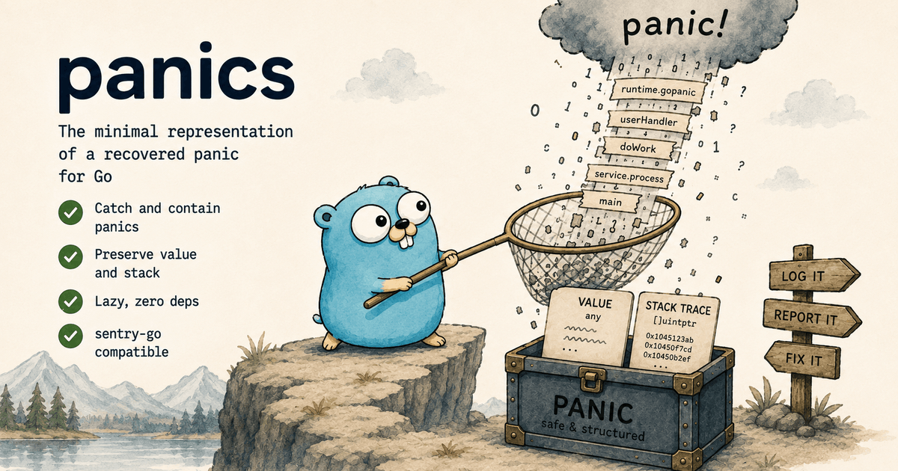

# `panics`: recovered panics for Go

[](https://github.com/gokern/panics/actions/workflows/ci.yml)
[](https://github.com/gokern/panics/actions/workflows/lint.yml)
[](https://github.com/gokern/panics/actions/workflows/codeql.yml)
[](https://pkg.go.dev/github.com/gokern/panics)
[](go.mod)
[](https://github.com/gokern/panics/releases)
[](LICENSE)

<p align="center">
  
</p>

The minimal representation of a recovered panic, for a package that runs code it
did not write.

## Install

```sh
go get github.com/gokern/panics
```

Requires Go 1.26+.

## Example

Wrap the call you do not control, and a panic in it becomes an ordinary error:

```go
if err := panics.Catch(userCallback); err != nil {
    // errors.Is(err, panics.ErrPanic) holds.
    // panics.As(err) reaches Value and StackTrace.
}
```

The panic stops at that boundary instead of reaching the runtime and taking
every other in-flight operation with it.

## Why

A library that calls a caller-supplied function has to decide what a panic in
it becomes. Answer that separately in each package and you get three
incompatible shapes, one of which loses the stack and another of which renders
it eagerly into a string no APM SDK can read.

This package holds the one answer: what was passed to `panic`, and where it
happened.

## Design

- **Zero dependencies.** stdlib only.
- **Lazy stack.** Program counters, symbolicated only when something renders
  them.
- **`StackTrace() []uintptr`** is the spelling `sentry-go` looks up by
  reflection, so panic frames reach a dashboard with no SDK dependency here.
- **No caller-dependent skip constant.** The stack is trimmed by locating
  `runtime.gopanic`, so the capture works at any nesting depth between a
  caller's deferred function and `Recover`.
- **Frozen v1.** The type is meant to be a shared `errors.As` target, and a v2
  would split the dependency graph as soon as two modules disagree about which
  one to depend on. The API grows only additively.

## API

| | |
|---|---|
| `Catch(fn func()) error` | run `fn`, contain a panic |
| `CatchError(fn func() error) error` | same, for a function that returns an error |
| `Recover(recovered any) *Panic` | the primitive, for a caller that owns its own `recover()` |
| `Is(err error) bool` | is this, or does it wrap, a panic |
| `As(err error) (*Panic, bool)` | reach `Value` and `StackTrace` |
| `ErrPanic` | the sentinel every `Panic` unwraps to |

One rule is worth repeating outside the godoc, because nothing in a build or a
passing test catches it: the `recover()` builtin must be called *directly* by the
deferred function. A frame deeper it returns `nil`, `Recover` returns `nil` with
it, and the panic keeps unwinding.

## Adopting this in a package

The conventions the `gokern` packages are written to, so that a consumer learns
the panic vocabulary once instead of once per dependency.

**Import it, do not re-export it.** `panics.Is(err)` answers "did anything
panic", `panics.As(err)` reaches the value and the stack, and both stay under this
module's name. A local name for the same value reads as "a function *this package*
was handed panicked" while matching a panic contained anywhere in the error,
including one the caller's own code recovered and reported as an ordinary failure.
A package whose errors can carry a `*Panic` has this module in its public surface
regardless, so there is no import to save.

**A sentinel of your own wraps this one rather than replacing it.** Join the two
with `fmt.Errorf("%w: %w", ErrYours, err)` and both questions keep an answer. A
sentinel that stands in place of this one reads the same at the call site and
silently switches off `panics.Is` and `panics.As` for everyone downstream.

You will probably not need one. None of the `gokern` packages kept a sentinel of
their own: `outboxer` shipped `ErrPublishPanicked` and `ErrCallbackPanicked` and
removed both in 0.4.0, because where the panic arrived already said which
function raised it. A task group that recovers at several points, and whose only
question afterwards is what to retain past shutdown, has even less to name — it
asks `panics.Is` and stops there.

**Filter on `panics.Is`.** `ErrPanic` is exported so that `errors.Is` answers
correctly on a panic somebody wrapped by hand, not as the way to ask the question.
It is a `var`: a package that copies it into a sentinel of its own is holding a
second mutable slot pointing at one value, and the two are one assignment apart
from disagreeing. `panics.Is(err)` asks through a function instead — nothing to
copy, nothing to let drift, and the sentinel stays on this side of the import.

## Scope

`panics` is the shape of a recovered panic and nothing else: the value, and the
stack it came from. Rendering belongs to an error-wrapping library such as
[werr](https://github.com/gokern/werr); classifying a panic and naming its call
site belong to whoever caught it. There are no formatters here, no global state,
and no `slog` integration.

## License

MIT.
